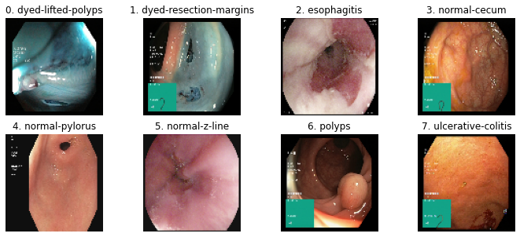
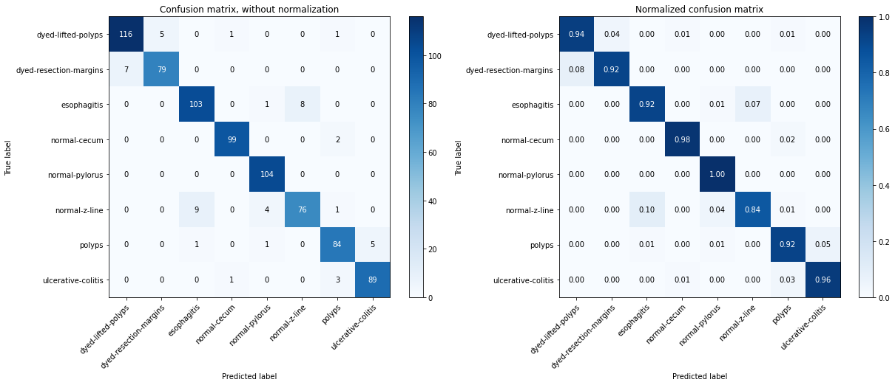
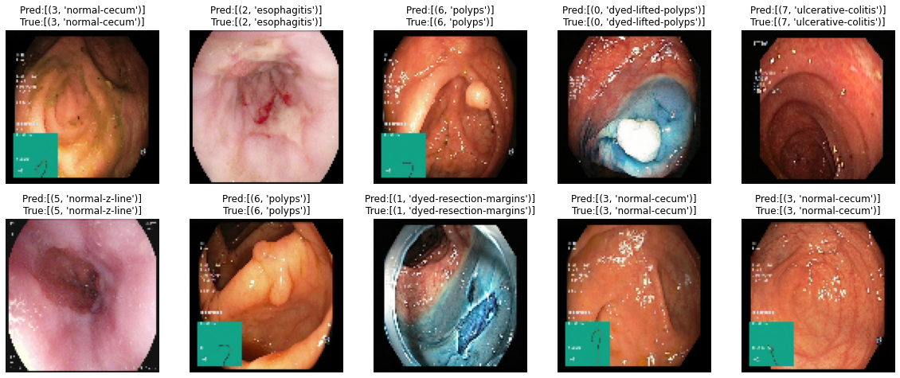

# **Classification des anomalies gastro-intestinaux par imagerie endoscopique avec apprentissage en profondeur**

- ### **Ouvrire le notebook avec:**

  Le notebook est disponible et pret a etre execute sur Kaggle et Colab depuit les liens suivent:

  <a href="https://githubtocolab.com/Hitsh987/projet_IARN/blob/master/endoscopy_multiClassification.ipynb" target="_parent"></a>   <a href='https://github.com/Hitsh987/projet_IARN/blob/master/endoscopy_multiClassification.ipynb' target="_blank"></a>  <a href='https://www.kaggle.com/hitsh987/endoscopy-multiclassification' target="_blank"></a>

## **Dataset**

Dans cette étude nous avons utilisé l'imagerie endoscopique du tractus gastro-intestinal humain afin de détecter différents types d'anomalies. Nous avons utilisé l'ensemble de données `KVASIR` pour cette tâche ainsi qu'un réseau de neurones convolutifs.

L'ensemble de données `KVASIR` se compose de 4 000 images annotées du tractus gastro-intestinal dans 8 classes différentes (différentes anomalies), chaque classe comporte 500 images.

Les 8 classes d'anomalies:

- dyed-lifted-polyps
- normal-cecum
- normal-pylorus
- normal-z-line
- esophagitis
- polyps
- ulcerative colitis
- dyed-resection-margins

## **Bibliothèques requis**

```python
import os
import cv2
import numpy as np
import pandas as pd
import matplotlib.pyplot as plt

# pour divisez les donnees en sous-ensembles d'entraînement et de test aléatoires.
from sklearn.model_selection import train_test_split

# pour calculer la matrice de confusion
from sklearn.metrics import confusion_matrix

# pour réduisez le taux d'apprentissage lorsqu'une métrique a cessé de s'améliorer.
from keras.callbacks import ReduceLROnPlateau

# pour pouvoir importer utiliser le modèle pré-entraîner VGG19
from tensorflow.keras.applications import VGG19

# pour convertit le vecteur (y) de classe (entiers) en matrice de classe binaire.
from tensorflow.keras.utils import to_categorical

# pour générer des images altere
from keras.preprocessing.image import ImageDataGenerator

# pour initialise le methode de le desente gradien
from tensorflow.keras.optimizers import SGD, Adam

from keras.models import Sequential, load_model
from keras.layers import Flatten, Dense, Dropout

```

## **1. Configurer le dataset**

### **1.1. Telecharger le dataset**

On vérifie l'environnement d'exécution du notebook (`Google Colab` ou `kaggle`), pour éviter de télécharger le dataset en local car sa taille dépasse les 1Gb.

Pour ce faire on utilise une des platforme (`Google Colab` ou `kaggle`) pour exécuter notebook sans télécharge le dataset sur notre machine.

Par ailleurs `Google Colab` et `Kaggle` offre l'option d'exécution avec GPU, ce qui accélérer considérablement les opérations d'apprentissage automatique.

Procède:

- si on est sur colab, on télécharger le dataset depuis le lien suivent (<https://datasets.simula.no/downloads/kvasir/kvasir-dataset.zip>).
  Le telechargement ne prendra que quelques secondes vu que le telechargment s'effectue sur le serveur de `Google Colab`
- si on est sur kaggel, le dataset sera accessible depuis le chemin suivent `../input/kvasir-dataset/kvasir-dataset`
- si on est-on local, le dataset sera accessible depuis le chemin suivent `./kvasir-dataset` vu qu'ont l'a déjà téléchargé

### **1.2. Definier les categories du dataset**

On définit les catégories (classes) du dataset a partir des noms de dossiers du dataset.
Le dataset se compose de 8 dossiers (un pour chaque classe) nommer suivent leur catégorie, chaque dossier comporte 500 images.

**Number of categories:  8**

<div>
<style scoped>
    .dataframe tbody tr th:only-of-type {
        vertical-align: middle;
    }

    .dataframe tbody tr th {
        vertical-align: top;
    }

    .dataframe thead th {
        text-align: right;
    }
</style>
<table border="1" class="dataframe">
  <thead>
    <tr style="text-align: right;">
      <th></th>
      <th>categorie</th>
      <th>numbre of files</th>
    </tr>
  </thead>
  <tbody>
    <tr>
      <th>0</th>
      <td>dyed-lifted-polyps</td>
      <td>500</td>
    </tr>
    <tr>
      <th>1</th>
      <td>dyed-resection-margins</td>
      <td>500</td>
    </tr>
    <tr>
      <th>2</th>
      <td>esophagitis</td>
      <td>500</td>
    </tr>
    <tr>
      <th>3</th>
      <td>normal-cecum</td>
      <td>500</td>
    </tr>
    <tr>
      <th>4</th>
      <td>normal-pylorus</td>
      <td>500</td>
    </tr>
    <tr>
      <th>5</th>
      <td>normal-z-line</td>
      <td>500</td>
    </tr>
    <tr>
      <th>6</th>
      <td>polyps</td>
      <td>500</td>
    </tr>
    <tr>
      <th>7</th>
      <td>ulcerative-colitis</td>
      <td>500</td>
    </tr>
  </tbody>
</table>
</div>

### **1.3. Cree l'ensmble des features X ainsi que les labels y**

pour ce faire on lit chaque image du dataset et on la met dans `X`, et on sauvegarde la classe de l'image lue dans `y`.

**Remarque**: on redimensionne les images lues en 100x100 pour accélérer l'étape d'apprentissage

### **1.4. Afficher une image aléatoire pour chaque catégorie**

On affiche pour chaque classe une image au hasard



## **2. Créations du model et apprentissage**

### **2.1. Cree l'ensemble d'apprentissage, test et de validation**

Dans cette etap on cree:

- l'ensemble d'entrainement `x_train`/`y_taine`
- l'ensemble de test `x_test`/`y_test`
- l'ensemble de validation `x_val`/`y_va`

#### **2.1.1. L'ensemble d'entrainment `(X/y)train` et de test `(X/y)test`**

On divise les données (X, y) en ensemble d'entrainement et de test en utilisant 80 % des données pour l'apprentissage et les 20 % restants pour les tests.

```
X_train: (3200, 100, 100, 3)
t_train: (3200, 1)
X_test: (800, 100, 100, 3)
y_test: (800, 1)
```

#### **2.1.2. Cree l'ensemble de validation `x_val/y_val`**

On divise 30% de l'ensemble d'entrainement en ensemble de validation

```
x_train:(2300, 100, 100, 3),  y_train:(2300, 1)
x_train:(900, 100, 100, 3),  y_train:(900, 1)
x_train:(800, 100, 100, 3),  y_train:(800, 1)
```

#### **2.1.3. Encodage à chaud (OneHot Encoding)**

Nous devons faire un encodage à chaud (OneHot Encoding) avec `to_categorical`, pour transformer l'ensemble des lables (`y_train`, `y_val` et `y_test`) de tel sorte à avoir un vecteur pour chaque exemple, car nous avons 8 classes et nous devrions nous attendre à ce que la forme de (`y_train`, `y_val` et `y_test`) passe de 1 à 8

```

x_train:(2300, 100, 100, 3),  y_train:(2300, 8)
x_train:(900, 100, 100, 3),  y_train:(900, 8)
x_train:(800, 100, 100, 3),  y_train:(800, 8)
```

### **2.2. Generation d'images**

On effectue l'augmentation des données d'image. Il s'agit de la technique utilisée pour augmenter la taille d'un ensemble de données d'apprentissage en créant des versions modifiées d'images dans l'ensemble de données. La création de ces images modifié s'effectue en pivotent de manière aléatoire ces images de n'importe quel degré entre 0 et 360.

Tout d'abord, nous définirons des instances individuelles d'ImageDataGenerator pour l'augmentation, puis nous les adapterons à chacun des ensembles de données d'entraînement, de test et de validation.

### **2.3. Telecharge le model pré-entraîné VGG19**

Maintenant, nous allons instancier le model `VGG19` qui est un réseau de neurones convolutif pré-entraîné en tant que modèle d'apprentissage par transfert.

Le plus grand avantage de ce réseau est que il a été pre-entraîné sur plus d'un million d'images de la base de données ImageNet.

Un réseau pré-entraîné peut classer les images en milliers de catégories d'objets. En raison de cet avantage, nous allons appliquer ce modèle sur notre dataset qui comporte 8 catégories, en lui ajoutent d'autre couches.

Nous allons maintenant définir `VGG19` comme une architecture d'apprentissage profond. Pour cela, il sera défini comme un modèle séquentiel de Keras à plusieurs couches denses.

    Model: "sequential"
    _________________________________________________________________
     Layer (type)                Output Shape              Param #   
    =================================================================
     vgg19 (Functional)          (None, 3, 3, 512)         20024384  
                                                                     
     flatten (Flatten)           (None, 4608)              0         
                                                                     
    =================================================================
    Total params: 20,024,384
    Trainable params: 20,024,384
    Non-trainable params: 0
    _________________________________________________________________

Ajouter des couches dense avec l'activation et la normalisation par lots

    Model: "sequential"
    _________________________________________________________________
     Layer (type)                Output Shape              Param #   
    =================================================================
     vgg19 (Functional)          (None, 3, 3, 512)         20024384  
                                                                     
     flatten (Flatten)           (None, 4608)              0         
                                                                     
     dense (Dense)               (None, 1024)              4719616   
                                                                     
     dense_1 (Dense)             (None, 512)               524800    
                                                                     
     dense_2 (Dense)             (None, 256)               131328    
                                                                     
     dropout (Dropout)           (None, 256)               0         
                                                                     
     dense_3 (Dense)             (None, 128)               32896     
                                                                     
     dense_4 (Dense)             (None, 8)                 1032      
                                                                     
    =================================================================
    Total params: 25,434,056
    Trainable params: 25,434,056
    Non-trainable params: 0
    _________________________________________________________________

### **2.4. Hyperparametrage**

Les hyperparamètres sont des paramètres réglables qui nous permettent de contrôler le processus d'entraînement du modèle. Les performances du modèle dépendent fortement des hyperparamètres.

Comme nous avons défini notre modèle, nous devons maintenant initialiser les hyperparamètres nécessaires pour former le modèle, puis enfin, nous allons compiler notre modèle.

```python
""" Initializing the hyperparameters """

# initialise le nombre d'échantillons d'apprentisage
batch_size = 100

# initialise le nombre d'iteration
epochs = 50

# taux d'apprentisage
learn_rate = 0.001

# initilisation de la descente du gradient
sgd = SGD(learning_rate=learn_rate, momentum=0.9, nesterov=False)

# compiler le model
model.compile(optimizer=sgd, loss="categorical_crossentropy", metrics=["accuracy"]) 

```

La reduction de taux d'apprentissage diminue le taux d'apprentissage après un certain nombre d'iteration si le taux d'erreur ne change pas. Ici, grâce à cette technique, nous surveillerons la précision de la validation et si cela cessé de s'améliorer on réduira le taux d'apprentissage de 0,01.

```python
# Learning Rate Annealer
lrr = ReduceLROnPlateau(monitor="val_acc", factor=0.01, patience=3, min_lr=1e-5)
```

### **2.5. Entrainement du le model**

On commençons à former notre model.

## **3. Evaluation du model**

### **3.1. Evaluer la précision sur l'ensemble de test**

Evaluer la précision ainsi que la perte du model sur l'ensemble de test

````
    Test loss: 0.337
    Test accuracy: 0.938
````

### **3.2. Matrice de confusion**

Enfin, nous visualiserons les performances de classification sur des données de test à l'aide de matrices de confusion.

Nous verrons le nombre exact de classifications correctes et incorrectes à l'aide de la matrice de confusion non normalisée, puis nous verrons la même chose en pourcentage à l'aide de la matrice de confusion normalisée.

Comme on peut le voir en classant les images en 8 classes, le modèle a donné une précision minimale de 84% et une précision maximale de 95%. Nous pouvons affiner davantage les paramètres de formation et réentraîner notre modèle pour voir toute mise à l'échelle possible dans la classification



### **3.3. Predicion au hasard**

Prédire des images choisies au hasard et compare la prédiction avec la vérité terrain


